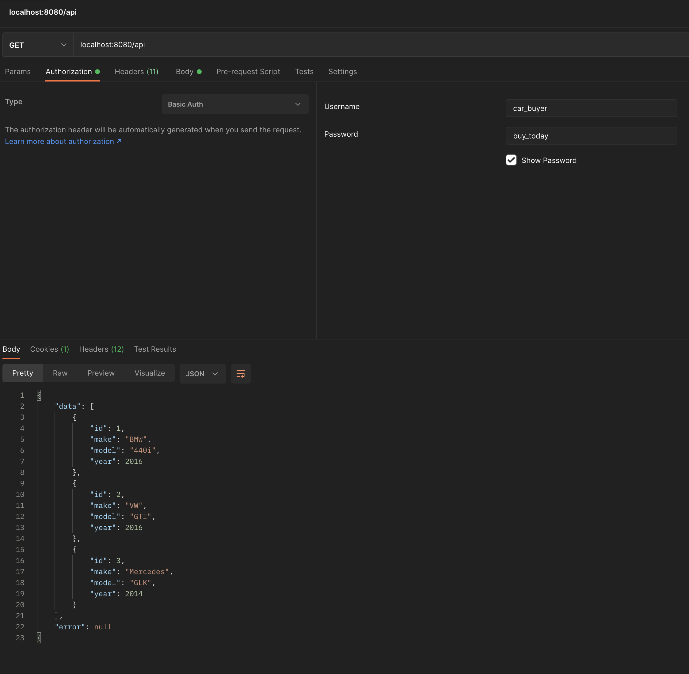
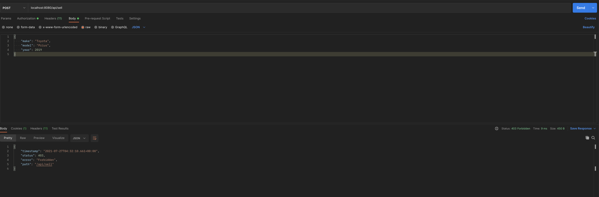
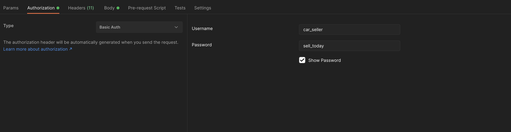
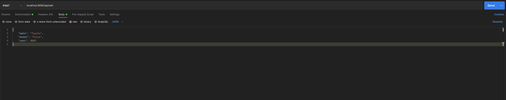

# Spring Basic Authentication

This is a simple REST API built with Spring Boot that utilizes Basic Authentication and User Roles

# Required Tech

Java 11, Maven, Postman (or another API client), IDE of your choice

# Setup & Launch


 - Download and compile the project with Maven using the provided 
   pom.xml
 - Run SpringBasicAuthApplication.java 


# Using REST API

There are two users with different roles: car_buyer and car_seller

car_buyer can consume the API with a GET request at /api

car_seller can consume and POST a new car (see POSTing to API below)

## API endpoints

GET cars in database: <a href="http:localhost:8080/api">localhost:8080/api</a> 

POST("sell") new car to database: <a href="http:localhost:8080/api/sell">localhost:8080/api</a> 

## Authenticating as car_buyer

Navigate to <a href="http:localhost:8080/api">localhost:8080/api</a> using Postman or your preferred API client and enter the
car_buyer credentials in when prompted:

username: car_buyer

password: buy_today



As you can see above, you will get a response containing the cars currently in the database

However, when you try to POST a car at /api/sell you will get a 403 Forbidden. That's because car_buyer isn't authorized to POST ("sell") cars to the database.



## Authenticating as car_seller and POSTing to /api/sell

Navigate to <a href="http:localhost:8080/api/sell">localhost:8080/api/sell</a> using Postman or your preferred API client and enter the
car_seller credentials when prompted:

username: car_seller

password: sell_today



### POST request 

Let's sell a 2019 Prius

Choose POST and pass the JSON object:

```
{
    "make": "Toyota",
    "model": "Prius",
    "year": 2019
}
```

Then click send!



Now issue a GET request at <a href="http:localhost:8080/api/">localhost:8080/api/</a>


Success! We can see that a new car is now stored in the database!

# Got Questions? Contact me!
efim@shulginmusic.com
